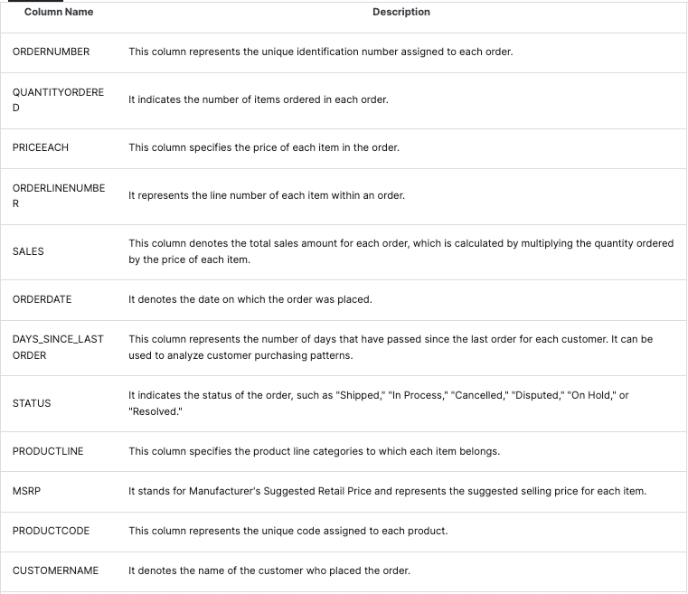
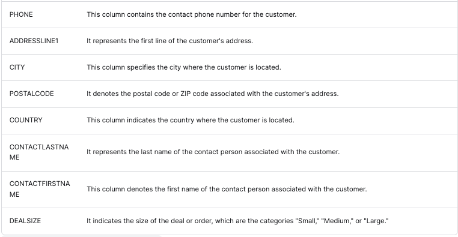

# Car Sales Visualizations

The following rubric us used to assess the data columns:

## Questions to answer:

* What was the total number of car orders placed over time?

Total Unique Orders: There were a total of 298 unique car orders placed over the period covered by the dataset
* What was the price increase of cars over time?

Price Increase Percentage: The average price of cars increased by approximately 1.83% from the beginning to the end of the period.

Compound Annual Growth Rate (CAGR) of Price: The CAGR for the car prices was about 0.76%, indicating the average annual growth rate in prices.
* What sales trends were observed?

Average Monthly Sales: The average sales value per month was approximately $336,559.

Median Monthly Sales: The median monthly sales value was $286,674.

Maximum Monthly Sales: The highest monthly sales value was $1,058,699.

Minimum Monthly Sales: The lowest monthly sales value was $129,754.

Standard Deviation of Monthly Sales: The sales figures varied with a standard deviation of about $222,199, indicating the volatility in monthly sales.

* What was the customer retention rate over time?

Average Customer Retention: The average monthly customer retention rate was about 15.65%.

Variance in Customer Retention: The variance in the customer retention rate was 0.0377, indicating the variability in retention rate over time.

* Any concerns with the car sales?

Outlier Months (Significant Deviations in Sales): There were significant deviations in sales in November 2018 and November 2019, as indicated by the outlier analysis. These months showed unusual spikes or drops in sales compared to the typical monthly sales trend.

## Datasets

* [Car Sales](